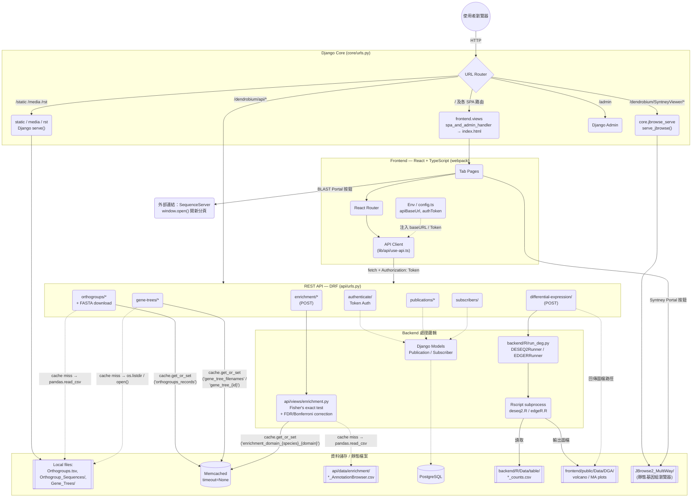

# 網路架構說明

本文件整理 `django-react-typescript` 目前的對外服務方式、連線路徑、port 配置，以及開發版與部署版之間的差異。

## 總覽

專案目前有三種主要運作模式：

1. 原生開發模式
2. Docker 模擬部署模式
3. Bare-metal / nginx 路徑分流模式

核心元件如下：

- React 前端開發伺服器：`webpack-dev-server`
- Django 應用伺服器：開發時用 `runserver`，部署時用 `gunicorn`
- PostgreSQL：主資料庫
- Memcached：快取，主要用於 production 設定
- JBrowse：基因組瀏覽器，可由 Django 或獨立 HTTP server 提供

## 系統架構圖



### 快取策略（Memcached cache-aside）

三個原本「每次請求都重新讀大檔案」的端點，目前都改成 cache-aside 模式，`timeout=None`（不過期，除非手動清除）：

| 端點 | Cache Key | 快取內容 | 原始資料來源 |
| --- | --- | --- | --- |
| `orthogroups/` | `orthogroups_records` | 整份 `Orthogroups.tsv` 解析後的 records | `RstFiles`（`pandas.read_csv`） |
| `gene-trees/` | `gene_tree_filenames` | `Gene_Trees/` 目錄檔名清單 | `RstFiles`（`os.listdir`） |
| `gene-trees/<id>/` | `gene_tree_{id}` | 單棵樹的 Newick 字串 | `RstFiles`（單檔 `open()`） |
| `enrichment/`（各 domain） | `enrichment_domain_{species}_{domain}` | 解析後的 `search_dict` / `targets`（7 物種 × 4 domain = 28 組） | `EnrichCsv`（`pandas.read_csv`） |

這些資料都是分析結果（OrthoFinder / 富集註解），除非重新跑分析否則不會變動，因此可以永久快取。若重新產生了這些檔案，需要手動執行：

```bash
python manage.py clearcache
```

來清空 Memcached，讓下一次請求重新讀取新檔案。

## Port 與路徑對照

| 元件 | 預設位址 | 用途 |
| --- | --- | --- |
| Frontend dev server | `http://<host>:4000` | React 開發介面 |
| Django dev server | `http://<host>:8866` | API、admin、靜態路由、JBrowse 路由 |
| Docker web | `http://<host>:8000` | Django + gunicorn 對外入口 |
| PostgreSQL | `<host>:5432` | 資料庫 |
| pgAdmin | `http://<host>:5050` | 開發用資料庫管理介面 |
| Memcached | `<host>:11211` | 快取 |
| JBrowse standalone | `http://127.0.0.1:9000/dendrobium/SyntneyViewer/` | 備援 JBrowse 靜態站 |

## 1. 原生開發模式

啟動方式：

```bash
pnpm dev
```

或需要一併啟動本地資料庫容器時：

```bash
pnpm dev:full
```

### 連線流向

```text
Browser
  -> http://<host>:4000
  -> webpack-dev-server
  -> React Router
  -> API requests to http://<host>:8866/api/...

Browser
  -> http://<host>:8866
  -> Django runserver
  -> /api/... /admin/... /static/... /media/... /dendrobium/SyntneyViewer/...
```

### 目前設定重點

- 前端由 `frontend/package.json` 的 `dev:react` 啟動，綁定 `0.0.0.0`
- 前端固定使用 port `4000`
- Django 開發伺服器由根目錄 `package.json` 的 `dev:backend` 啟動，綁定 `0.0.0.0:8866`
- 前端 API base URL 會優先讀 `API_BASE_URL`，否則使用瀏覽器目前 hostname 組成 `http(s)://<current-host>:8866`
- `/home`、`/analysis`、`/syntney` 等頁面由 React Router 處理

### 對外存取注意點

- `webpack-dev-server` 目前允許外部 Host 存取，`allowedHosts` 已設為 `"all"`
- Django 開發環境的 CORS 白名單目前允許：
  - `http://0.0.0.0:4000`
  - `http://localhost:4000`
  - `http://127.0.0.1:4000`
  - `http://140.116.214.140:4000`
- 因此前端頁面可由 `http://140.116.214.140:4000/home/` 載入，並向 `http://140.116.214.140:8866/api/...` 發出請求

## 2. Docker 模擬部署模式

啟動方式：

```bash
docker compose -f docker-compose.yml -f docker-compose.localhost.yml up -d
```

### 容器關係

```text
Browser
  -> http://<host>:8000
  -> web container (gunicorn + Django)
  -> postgres container
  -> memcached container
```

### 容器與 port

| 服務 | 容器內 | 主機對外 |
| --- | --- | --- |
| web | `8000` | `8000:8000` |
| postgres | `5432` | `5432:5432` |
| memcached | `11211` | `11211:11211` |

### web 容器行為

`web` 容器啟動時會依序執行：

1. `manage.py migrate`
2. `manage.py collectstatic --no-input`
3. `manage.py clearcache`
4. `gunicorn core.wsgi -b 0.0.0.0:8000`

這個模式下沒有獨立的前端 dev server。React 資產會先被建置，再由 Django 提供。

## 3. Bare-metal / nginx 路徑分流模式

README 與 `config/nginx/` 保留了一套偏正式環境的配置概念，核心是用 nginx 做路徑分流：

```text
Browser
  -> https://example.com/dendrobium/
  -> nginx
  -> React 靜態檔

Browser
  -> https://example.com/dendrobium/SyntneyViewer/
  -> nginx
  -> JBrowse 靜態檔

Browser / reverse proxy
  -> nginx
  -> Django / gunicorn
```

### 路徑分工

- `/dendrobium/`：React 靜態站
- `/dendrobium/SyntneyViewer/`：JBrowse 靜態站

這種模式的重點是讓 React 和 JBrowse 都透過同一網域提供，減少跨來源問題。

## 4. Django 對外路由

`core/urls.py` 目前主要提供以下入口：

| 路徑 | 說明 |
| --- | --- |
| `/admin/` | Django admin |
| `/api/` | Django REST Framework API |
| `/static/` | Django 靜態檔 |
| `/media/` | Django 媒體檔 |
| `/rst/` | 額外資料目錄 |
| `/dendrobium/SyntneyViewer/` | JBrowse 靜態檔入口 |
| 其他路徑 | 交給 `frontend.urls` |

JBrowse 路由由 Django 直接以 `serve` 提供，根目錄來自：

- 環境變數 `JBROWSE_DIR`
- 若未設定，預設 `../JBrowse2_MultiWay`

## 5. JBrowse 供應方式

JBrowse 目前有兩種供應方式。

### 方式 A：經由 Django 路徑提供

- React `/syntney` 頁面只作為 iframe 容器頁
- 前端預設內嵌 `/dendrobium/SyntneyViewer/`
- Django 直接把 `JBROWSE_DIR` 指到的資料夾內容送出
- 優點是前端與 JBrowse 可以維持同源，且不會把 iframe 指回 React 自己

### 方式 B：獨立 HTTP server 提供

可使用：

```bash
pnpm run jbrowse
```

對應腳本會：

1. 確認 `JBROWSE_DIR`
2. 清掉已占用 `9000` 的程序
3. 啟動 `http-server`

預設值：

- `JBROWSE_HOST=127.0.0.1`
- `JBROWSE_PORT=9000`
- `JBROWSE_BASE_PATH=/dendrobium/SyntneyViewer`

這個模式通常作為本機備援，不是目前主要的正式對外方式。

## 6. 前後端互動方式

前端頁面由 React Router 控制，例如：

- `/`
- `/home`
- `/analysis`
- `/orthogroups`
- `/transcriptome`
- `/syntney`

前端頁面若需要後端資料，會呼叫 Django API，例如：

- `/api/publications/`
- `/api/orthogroups/`
- `/api/gene-trees/`
- `/api/differential-expression/`

API 請求會帶 DRF Token：

```text
Authorization: Token <AUTH_TOKEN>
```

## 7. 跨來源與 Host 設定

### 開發環境

- Django `ALLOWED_HOSTS` 在 base 設定中目前為 `["*"]`
- Django `CORS_ORIGIN_WHITELIST` 在 `core/settings/dev.py` 中維護
- 前端 dev server 接受外部 Host，方便用伺服器 IP 直接測試

### Production 設定

- `core/settings/prod.py` 會從環境變數 `ALLOWED_HOSTS` 讀值
- `CORS_ORIGIN_WHITELIST` 目前還是範例網域：
  - `https://example.com`
  - `https://www.example.com`
- 如果要正式上線，這裡應改成實際網域

## 8. 目前建議的理解方式

如果你現在是在伺服器上開發，最值得記住的是這一條：

```text
瀏覽器 -> 140.116.214.140:4000 -> React 頁面
React 頁面 -> 140.116.214.140:8866 -> Django API
```

如果你切到 Docker 模式，則改成：

```text
瀏覽器 -> <host>:8000 -> Django + gunicorn
```

如果你走 nginx 正式部署，則會變成：

```text
瀏覽器 -> nginx -> React / JBrowse / Django
```

## 9. 後續維護建議

- 若未來正式對外只保留一個入口，建議以 nginx 或單一反向代理統一收斂 port
- 若前端與後端長期分離部署，建議把 `API_BASE_URL` 改為明確環境變數，不要只依賴瀏覽器 hostname 推導
- 若 JBrowse 要對外提供，優先考慮同源路徑 `/dendrobium/SyntneyViewer/`，會比獨立 `:9000` 穩定
- 若要給團隊交接，建議把實際使用中的網域、IP、SSL 與防火牆規則補進這份文件
